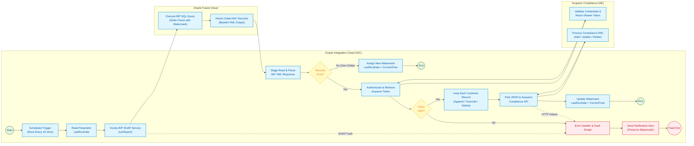

```mermaid
flowchart LR
    classDef process fill:#e1f5fe,stroke:#0288d1,stroke-width:1.5px,color:#01579b;
    classDef decision fill:#fff9c4,stroke:#fbc02d,stroke-width:1.5px,color:#f57f17;
    classDef startend fill:#e8f5e9,stroke:#388e3c,stroke-width:2px,color:#1b5e20;
    classDef error fill:#ffebee,stroke:#d32f2f,stroke-width:1.5px,color:#b71c1c;

    subgraph FUSION ["Oracle Fusion Cloud"]
        F1["Execute BIP SQL Query<br/>(Delta Check with Watermark)"]:::process
        F2["Return Delta DNC Records<br/>(Base64 XML Output)"]:::process
    end

    subgraph OIC ["Oracle Integration Cloud (OIC)"]
        Start((Start)):::startend --> O1["Scheduled Trigger<br/>(Runs Every 15 mins)"]:::process
        O1 --> O2["Read Parameter<br/>LastRunDate"]:::process
        O2 --> O3["Invoke BIP SOAP Service<br/>(runReport)"]:::process
        
        O3 --> F1
        F1 --> F2
        F2 --> O4["Stage Read & Parse<br/>BIP XML Response"]:::process
        
        O4 --> D1{"Records<br/>Exist?"}:::decision
        
        D1 -- "No (Zero Delta)" --> O5["Assign New Watermark<br/>LastRunDate = CurrentTime"]:::process
        O5 --> End1((End)):::startend
        
        D1 -- "Yes" --> O6["Authenticate & Retrieve<br/>Acqueon Token"]:::process
        
        O6 --> D2{"Token<br/>Valid?"}:::decision
        
        D2 -- "Yes" --> O7["Loop Each Customer Record<br/>(Append / Override / Delete)"]:::process
        
        O7 --> O8["Post JSON to Acqueon<br/>Compliance API"]:::process
        
        O8 --> O9["Update Watermark<br/>LastRunDate = CurrentTime"]:::process
        O9 --> End2((End)):::startend
        
        O3 -.->|SOAP Fault| ErrHandler["Error Handler & Fault Scope"]:::error
        D2 -- "No" --> ErrHandler
        O8 -.->|HTTP Failure| ErrHandler
        
        ErrHandler --> Alert["Send Notification Alert<br/>(Preserve Watermark)"]:::error
        Alert --> EndErr((Fault End)):::error
    end

    subgraph ACQUEON ["Acqueon Compliance (AE)"]
        A1["Validate Credentials &<br/>Return Bearer Token"]:::process
        A2["Process Compliance DNC<br/>(Add / Update / Delete)"]:::process
    end

    O6 --> A1
    A1 --> O6
    O8 --> A2
    A2 --> O8
```

